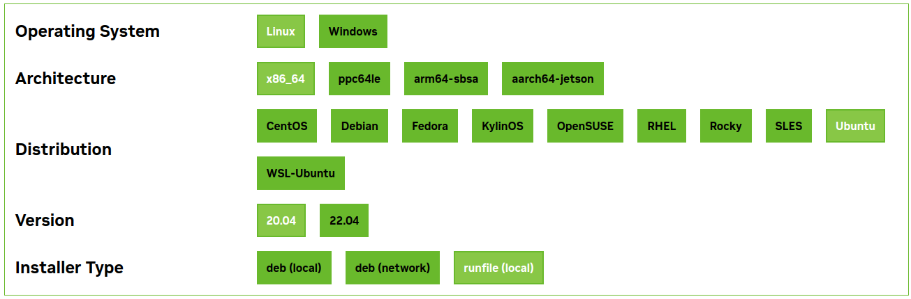

# Multiple CUDA Version at Same Machine
As an AI Engineer, I have to use virtual environments to manage Python and other dependency setups, including CUDA, to harness GPU acceleration. But when trying different solutions or implementing new projects/ideas, there happens to be a common situation where we need a different CUDA version and have to keep the existing CUDA version as well because of other existing projects. I believe we all have faced the same type of dilemma at least once throughout our development journey. I have faced it several times and overcome it using the following steps.

## Step 1
Download the your required CUDA file from [this](https://developer.nvidia.com/cuda-toolkit-archive) link and download the `.run` file like following




Now run the download commands command in the `Red Box`
```
wget https://developer.download.nvidia.com/compute/cuda/11.8.0/local_installers/cuda_11.8.0_520.61.05_linux.run
```

## Step 2
Go the downloaded folder location and open a terminal and run the command

```
chmod +x <downloaded_run_file_name>
```
for me the command is
```
chmod +x cuda_11.8.0_520.61.05_linux.run
```
## Step 3
Now run the following command to install CUDA on your machine but remember we will have to install only CUDA
```
sudo ./<downloaded_run_file_name> --silent --toolkit
```
for me the command is
```
sudo ./cuda_11.8.0_520.61.05_linux.run --silent --toolkit
```
here
```
--silent flag indicates that the installation process should proceed without any user interaction.
--toolkit command in the context of installing CUDA refers to specifying that only the CUDA Toolkit component should be installed.
```

## Step 4
Now go to home and open .bashrc file in a text editor. [ If you don't see it then press `ctrl + h` ]

Remove/Comment your `CUDA` related path [ I would suggest to comment as you may need them in future ]

Now add these two lines at the bottom of the `.bashrc` file
```
export PATH=/usr/local/cuda-11.8/bin:$PATH
export LD_LIBRARY_PATH=/usr/local/cuda-11.8/lib64:$LD_LIBRARY_PATH
```
**Note:** depending on your CUDA version `cuda-11.8` will change, like for CUDA 12.2 it will be `cuda-12.2`

save it and open a terminal at your home where your `.bashrc` file is located, and run the following command
```
source .bashrc
```
And now check your CUDA toolkit by running following command
```
nvcc --version
```
or
```
nvidia-smi
```
